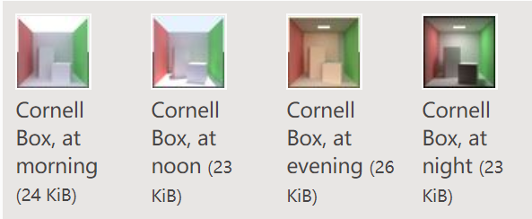
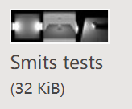
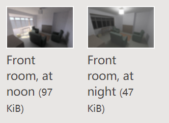

## MiniLight

​	MiniLight是一个小型的全局光照渲染器。

### 描述

​	MiniLight是一个小型的全局光照渲染器。它是一个简单的实现，但这也让它在某种意义上成为了开发和实验的良好基准。它可能还是最简洁和整齐的渲染器（代码大概只有650行），并且被翻译成了好几种不同的编程语言。

​	有人问我如何在三个月内开发一款渲染器。这时间其实不太够，但让我开始思考一个程序能够保持完整的基于物理的模拟，并同时具有简洁、良好的设计时，到底能够有多小。这个想法让我忍俊不禁，并迫不及待地动手实践了起来。

​	MiniLight是一个命令行工具。它会读取一个文本文件作为模板并通过该模板生成一个PPM格式的图像文件。支持平台有**Mac，Linux，Windows**。

​	渲染特性有：

- 蒙特卡洛路线追踪运输
- 发射器采样
- 渐进式细化
- RGB灯光
- 漫射材料
- 三角建模函数
- 八叉树空间索引
- 针孔镜头
- 病房线性色调映射

### 图像

​	Cornell盒子在一天中的变化

:

​	这个模型也是有物理基础的。比如，在中午的时候：天空的色温为10000K，亮度为1×104cd / m2。太阳的色温为5400K，亮度为1×109cd / m2，直径为1.392×109米，距离为149.6×109米。

​	一些Smits测试场景：

​	.

​	一个房子，在中午和晚上：

.

​	所有的这些图片都是每像素渲染1000条路径。标准的Cornell盒，500 * 500像素，在2007年的机器上将花费大概15min的时间。

​	（一般来说，模板文件只是一个简单并独立的文本文件，但如果采用JSON格式的化，最好采用推荐的JSON格式）

